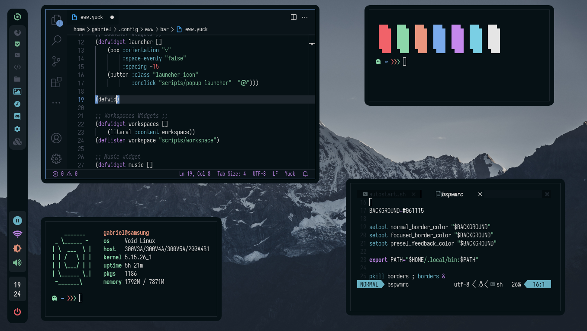

# Nightlypwn

The definitive configuration for bspwm using eww as bar and widgets, and the night colorscheme!



## Requirements

- JetBrainsMono Nerd Font
- Iosevka Nerd Font
- sxhkd
- bspwm
- alacritty
- kitty
- neofetch
- eww
- cava
- rofi
- bash
- fish
- sh
- dunst
- feh
- picom

## Installation

To install first make sure you have all the [requirements](#requirements)

Simply copy the configuration files:

```sh
git clone https://github.com/NightCS/nightlypwn.git nightlypwn
cd nightlypwn
rm -rf ~/.config
cp -r ./configs ~/.config
```

Change your default shell to fish

```sh
sudo usermod --shell $(which fish) $(whoami)
```

Restart font cache:

```sh
fc-cache -r
```

And then restart the system using bspwm in your login manager
